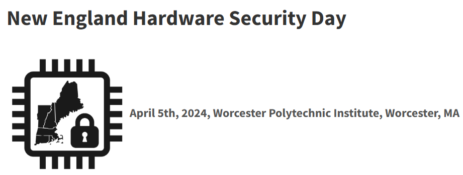
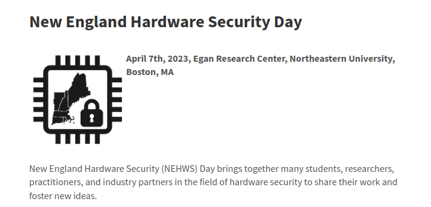
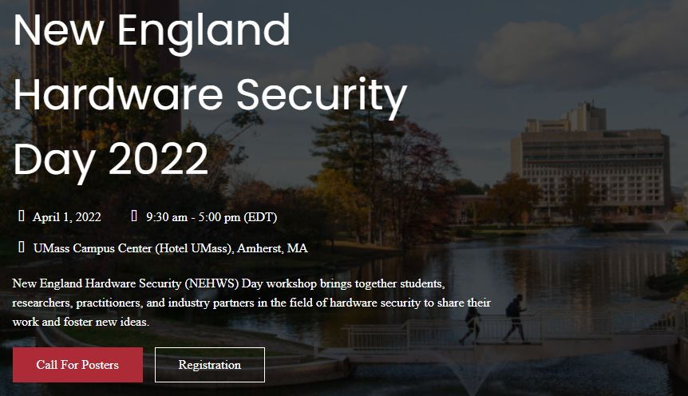

* [NEHWS 2025](#nehws-2025--massachusetts-institute-of-technology-cambridge), 4/18/2025, Massachusetts Institute of Technology, Cambridge, MA
* [NEHWS 2024](#nehws-2024--worcester-polytechnic-institute-worcester), 4/5/2024, Worcester Polytechnic Institute, Worcester, MA
* [NEHWS 2023](#nehws-2023--northeastern-university-boston), 4/7/2023, Northeastern University, Boston, MA
* [NEHWS 2022](#nehws-2022--university-of-massachusetts-amherst), 4/1/2022, University of Massachusetts, Amherst, MA
* [NEHWS 2021](#nehws-2021--virtual), 4/9/2021, Virtual

### NEHWS 2025 @ Massachusetts Institute of Technology, Cambridge ###
<figure class="fourth">

</figure>

The fifth NEHWS was organized on 18 April, 2025 at the Massachusetts Institute of Technology in Cambridge, MA.

| Time                      | Session Chair          | Session Details  |	
| ---------------------- | :-----------------: | -------------------------------------------------------------------------------------- |
| **9:00 - 9:15**           | Mengjia Yan                    | **Welcome Remarks**                                                                                         |
| **9:15 - 9:30**           | Mengjia Yan                    | **Opening remarks**                                                                                         |
|                           |                        | **News from the NEHWS Community**                                                                           |
| **9:30 - 10:30**          | Mengjia Yan                    | **[Invited Keynote](/images/toddaustin.pdf) by [Todd Austin](/speakers#todd-austin) (UMich)**                                                                  |
| **10:30 - 10:45**         |                        | Break                                                                                                       |
| **10:45 - 12:00**         | Xiaolin Xu                    | **Submitted Talks— Session I**                                                                              |
|                           |                        | **Long Talk:** [*FaultDetective: Explainable to a Fault, from the Design Layout to the Software*](/images/am1_nehws2025_slides.pdf)             |
|                           |                        | Zhenyuan Liu, Dillibabu Shanmugam, and Patrick Schaumont                                                    |
|                           |                        | **Short Talk:** [*BackMon: IC Backside Tamper Detection using On-Chip Impedance Monitoring*](/images/backmon.pdf)                  |
|                           |                        | Tahoura Mosavirik and Shahin Tajik                                                                          |
|                           |                        | **Long Talk:** *Who is in Control? Security Risks in Commercial ADAS*                                       |
|                           |                        | Yingjie Cao, George Crane, Haoqi Shan, and Dean Sullivan                                                    |
|                           |                        | **Short Talk:** [*Energy-Accuracy-Security Trade-offs in Resistive In-Memory Computing Architectures*](/images/am4_NEHWS_ShortTalk_SaionRoy.pdf)        |
|                           |                        | Saion Roy and Naresh Shanbhag                                                                               |
|                           |                        | **Long Talk:** [*VGF: Value-Guided Fuzzing – Fuzzing Hardware as Hardware*](/images/am5_presentation.pdf)                                   |
|                           |                        | Ruochen Dai, Michael Lee, Patrick Hoey, Weimin Fu, Yier Jin, Xiaolong Guo, Shuo Wang, Dean Sullivan, Tuba Yavuz, and Orlando Arias |
|                           |                        | **Short Talk:** [*USBSnoop – Revealing Device Activities via USB Congestions*](/images/am6_USBSnoop.pdf)                                |
|                           |                        | Davis Ranney, Yufei Wang, A. Adam Ding, and Yunsi Fei                                                        |
| **12:00 - 1:30**          |                        | **Lunch and Poster Session**                                                                                |
| **1:30 - 2:30**           | Daniel Holcomb         | **Panel Discussion:** *"Secure-by-Construction for Hardware Design: Mission Impossible or Walk in the Park?"* |
|                           |                        | - [Shivam Bhasin](/speakers#shivam-bhasim) (Nanyang Technical University)                                                              |
|                           |                        | - [Srini Devadas](/speakers#srini-devadas) (Massachusetts Institute of Technology)                                                     |
|                           |                        | - [Sharad Malik](/speakers#sharad-malik) (Princeton University)                                                                       |
|                           |                        | - [Christof Paar](/speakers#chris-paar) (Max Planck Institute)                                                                      |
|                           |                        | - [Dominic Rizzo](/speakers#dom-rizzo) (zeroRISC)                                                                                  |
| **2:30 - 3:30**           | Dean Sullivan                    | **Invited Keynote by [Ed. Suh](/speakers#ed-suh) (Nvidia)**                                                                     |
| **3:30 - 3:40**           |                        | Break                                                                                                       |
| **3:40 - 4:45**           | Dean Sullivan                    | **Submitted Talks— Session II**                                                                             |
|                           |                        | **Long Talk:** [*Exploiting Exclusive System-Level Cache in Apple M-Series SoCs for Enhanced Cache Occupancy Attacks*](/images/pm1_10_2_TianhongXu.pdf) |
|                           |                        | Tianhong Xu, Aidong Ding, and Yunsi Fei                                                                     |
|                           |                        | **Short Talk:** [*Uncertainty Estimation in Neural Network-enabled Side-channel Analysis and Links to Interpretability*](/images/pm2_NEHWS_MN_final.pdf) |
|                           |                        | Seyedmohammad Nouraniboosjin and Fatemeh Ganji                                                           |
|                           |                        | **Long Talk:** [*Oreo: Protecting ASLR Against Microarchitectural Attacks*](/images/oreo.pdf)                                 |
|                           |                        | Shixin Song, Joseph Zhang, and Mengjia Yan                                                                 |
|                           |                        | **Short Talk:** [*Cross-Layer EM Fault Injection Assessment Framework*](/images/pm4_NEHWS_EMFI.pdf)                                       |
|                           |                        | Hanqiu Weng, Ruochen Dai, Tuba Yavuz, Xiaolong Guo, Orlando Arias, Dean Sullivan, Siqi Dai, Honggang Yu, Michael Lee, Domenic Forte, and Shuo Wang |
|                           |                        | **Long Talk:** [*IvLeague: Side Channel-resistant Secure Architectures Using Isolated Domains of Dynamic Integrity Trees*](/images/ivLeauge.pdf) |
|                           |                        | Md Hafizul Islam Chowdhury and Fan Yao                                                                       |
| **4:45 - 5:45**           | Patrick Schaumont                    | **[Invited Keynote](/images/nagata.pdf) by [Makoto Nagata](/speakers#makoto-nagata) (Kobe University)**                                                      |
| **5:45 - 6:00**           | Yingjie Lao            | **Best Poster Award and Closing Remarks**                                                                   |
| **6:00 - 7:00**           |                        | **Networking reception**                                                                                    |

### **Posters** ###

- *On-die Differential Sensing for Monitoring and Analysis of Dynamic Computing Environments*, Shahriar Hadayeghparast, Xiang Li, Aleksa Deric, and Daniel Holcomb

- *Hardware Acceleration for Fully Homomorphic Encryption Scheme Switching from CKKS to FHEW*, Kaiyuan Zhang, Antian Wang, Keshab Parhi, and Yingjie Lao

- *Logical Maneuvers: Detecting and Mitigating Adversarial Hardware Faults in Space*, Fatemeh Khojasteh Dana, Saleh Khalaj Monfared, and Shahin Tajik

- *Side-channel Threats in Fault-Tolerant Quantum Computers*, Theodoros Trochatos, Christopher Kang, Frederic T. Chong, and Jakub Szefer

- *Securing HHL Quantum Algorithm against Quantum Computer Attacks*, Yizhuo Tan, Hrvoje Kukina, and Jakub Szefer

- *Winograd for NTT: A Case Study on Higher-Radix and Low-Latency Implementation of NTT for Post Quantum Cryptography on FPGA*, Suraj Mandal and Debapriya Basu Roy

- *An On-Chip Sensor Placement Strategy for Voltage-Drop Attack Mitigation*, Mashrafi Alam Kajol, Sandeep Sunkavilli, and Qiaoyan Yu

- *Fault Injection on Reinforcement Learning*, Tom Slooff, Anthony Etim, Jiaqi Yu, Francesco Regazzoni, and Jakub Szefer

- *ChipletPing: On-die Digital Impedance Sensing for Chiplet and Interposer Verification*, Saleh Monfared, Maryam Saadat Safa, and Shahin Tajik

- *Reverse Cross Entropy Optimizations for Efficient Adversarial Detection and Defense*, Zirui Fu and Marco Donato

- *CAPRI6: A Solution for Fault Root Cause Detection*, Dillibabu Shanmugam, Zhenyuan Liu, and Patrick Schaumont

- *LeakFlow: Power Side-Channel Leakage Simulation and Assessment Tool*, Andrew Malnicof, Zhenyuan Liu, and Patrick Schaumont

- *Security Attacks Abusing Pulse-level Quantum Circuits*, Chuanqi Xu and Jakub Szefer

- *Integrated Security Mechanisms for Weight Protection in Memristive Crossbar Arrays*, Muhammad Faheemur Rahman and Wayne Burleson

- *X-DFS: Explainable Artificial Intelligence Guided Design-for-Security Solution Space Exploration*, Tanzim Mahfuz and Prabuddha Chakraborty

- *LooseWire: Identifying Root Causes of Side-channel Leakage in an Open-Source FPGA*, Evan Apinis, Zhenyuan Liu, and Patrick Schaumont

- *AI-enabled, Automated, and Efficient Electromagnetic Side-Channel Acquisition*, Dev M. Mehta, Maryam Saadat Safa, Alessandra Savio Serpes, Seyedmohammad Nouraniboosjin, Shahin Tajik, and Fatemeh Ganji

- *Automation of Photon Emission Analysis Pipeline for Hardware Security*, Spencer Harding, Keegan Kuhn, Scott West, Dev M. Mehta, Shahin Tajik, and Fatemeh Ganji

- *Chosen Cyphertext Attack on Barret Reduction in CRYSTALS-Kyber*, Yashaswini Makaram, Yunsi Fei, and David Kaeli

- *Cross CPU-GPU Rowhammer Attack*, Yufei Wang

### NEHWS 2024 @ Worcester Polytechnic Institute, Worcester ###

<figure class="fourth">
  <a href="https://microelectronicscommons.org/connect/northeast-microelectronics-coalition/">
  <a href="https://www.nsf.gov">
  <a href="https://www.masstech.org">
  <a href="https://www.draper.com">
  <a href="https://www.analog.com/en/index.html">
</figure>

The fourth NEHWS was organized on 5 April, 2024 at the Worcester Polytechnic Institute in Worcester, MA.

|    						 | Session Chair | 				                                                                                    |
| ---------------------- | :-----------------: | -------------------------------------------------------------------------------------- |
| **9:00&nbsp;-&nbsp;9:15** | Shahin Tajik| **Welcome Remarks**                                                                        |
| **9:15 - 9:30**      | Fatemeh Ganji| **Opening remarks by Ben Linville-Engler (MassTech) "ME Commons and CHIPS Act"**  |
|							 |						 | **News from the NEHWS Community** |
| **9:30 - 10:30**    | Fatemeh Ganji | **Invited Keynote:** Sharad Malik, *Don’t Trust, and Verify* |
| **10:30&nbsp;-&nbsp;10:45**  |    						| Break                                                                                  |
| **10:45 - 12:00**  | Xiaolin Xu        | **Submitted Talks Session I**                                                              |
| 						     |    					  | **Long Talk:** [*Breaching Privacy: Memory Scraping Attack on Xilinx FPGAs*]({{ site.baseurl }}/images/Bharadwaj_NEHWS_24.pptx) |
| 						     |    					  | <u>Bharadwaj Madabhushi</u>, Sandip Kundu and Daniel Holcomb (University of Massachusetts Amherst)|
| 						     |    					  | **Short Talk:** *Driving into The Unknown: Investigating and Addressing Security Breaches in Vehicle Infotainment System* |
| 						     |    					  | Yingjie Cao, Haoqi Shan, <u>Maisha Mastora</u> and Dean Sullivan (University of New Hampshire) |
| 						     |    					  | **Long Talk:** [*Deep-learning Model Extraction through Software-based Power Side-channel*]({{ site.baseurl }}/images/Zhang_NEHWS2024.pptx) |
| 						     |    					  | <u>Xiang Zhang</u>, A. Adam Ding and Yunsi Fei (Northeastern University) |
| 						     |    					  | **Short Talk:** [*SecureLoop: Design Space Exploration of Secure DNN Accelerators*]({{ site.baseurl }}/images/KyungmiLee_NEHWS.pptx) |
| 						     |    					  | <u>Kyungmi Lee</u>, Mengjia Yan, Joel Emer and Anantha Chandrakasan (Massachusetts Institute of Technology) |
| 						     |    					  | **Long Talk:** [*LeakyOhm: Secret Bits Extraction using Impedance Analysis*]({{ site.baseurl }}/images/Monfared_LeakyOhmNEHWS24.pptx) |
| 						     |    					  | <u>Saleh Khalaj Monfared</u>, Tahoura Mosavirik and Shahin Tajik (Worcester Polytechnic Institute) |
| 						     |    					  | **Short Talk:** [*A Full-Stack Approach for Side-Channel Secure ML Hardware*]({{ site.baseurl }}/images/Aysu_boston.pptx) |
| 						     |    					  | Anuj Dubey and <u>Aydin Aysu</u> (North Carolina State University) |
| **12:00 - 1:30**    |   					  | **Lunch and Poster Session**                         |
| **1:30 - 2:30**     | Mengjia Yan | **Panel Discussion:** The Good and the Bad of Hardware Security                |
|                        |						  | Panelists:                                                                             |
|                        |						  | - Dominic Rizzo (zeroRISC Inc.)															  |
|                        |						  | - Gayatri Perlin (BAE)																			  |
|                        |						  | - Silviu Chiricescu (DRAPER)																  |
|                        |						  | - Ed Suh (Meta/Cornell)																			  |
|                        |						  | - Wajdi K. Feghali (Intel)																		  |
| **2:30 - 3:30**        | Xiaolin Xu | **Invited Keynote:** Andreas Olofsson, *Composable chiplets and implications for disaggregated design*  |
| **3:30 - 3:40**        |						  | Break                                                                                  |
| **3:40 - 4:45**        | Fatemeh Ganji | **Submitted Talks Session II**                                                         |
| 						     |    					  | **Long Talk:** [*Architectures for Secure Quantum Computing Systems*]({{ site.baseurl }}/images/szefer-nehws-2024-long-talk.pptx) |
| 						     |    					  | <u>Jakub Szefer</u> (Yale University) |
| 						     |    					  | **Short Talk:** [*1/0 Shades of UC: Photonic Side-Channel Analysis of Universal Circuits*]({{ site.baseurl }}/images/Mehta_NEHWS_talk.pptx) |
| 						     |    					  | <u>Dev Mehta</u>, Mohammad Hashemi, Domenic Forte, Shahin Tajik and Fatemeh Ganji (Worcester Polytechnic Institute) |
| 						     |    					  | **Long Talk:** [*Protecting Sensors from Electromagnetic Side-channel Leakage*]({{ site.baseurl }}/images/Long_NEHWS24.pptx) |
| 						     |    					  | <u>Yan Long</u> and Kevin Fu (Northeastern University) |
| 						     |    					  | **Short Talk:** [*On the Feasibility of Golden-free PCB Verification*]({{ site.baseurl }}/images/Sadatsafa_GoldenNEHWS.pptx) |
| 						     |    					  | <u>Maryam Saadat Safa</u>, Patrick Schaumont and Shahin Tajik (Worcester Polytechnic Institute) |
| 						     |    					  | **Long Talk:** [*EntryBleed: A Universal KASLR Bypass against KPTI on Linux*]({{ site.baseurl }}/images/Liu_Entrybleed_NEHWS.pdf) |
| 						     |    					  | <u>William Liu</u>, Joseph Ravichandran and Mengjia Yan (Massachusetts Institute of Technology) |
| **4:45 - 5:00**        | Qiaoyan Yu and Koksal Mus | **Best Poster Award and Closing Remarks**                                                  |
| **5:00 - 6:00**        |						  | **Networking reception**             |

### **Posters** ###

- *Extending FPGA Information Leaks with Trojan Phantom Circuits*, Anthony Etim, Shanquan Tian and Jakub Szefer

- *NNTesting: Neural Network Fault Attacks Detection Using Gradient-Based Test Vector Generation*, Antian Wang and Yingjie Lao

- *VertexSerum: Poisoning Graph Neural Networks for Link Inference*, Ruyi Ding, Shijin Duan, Xiaolin Xu and Yunsi Fei

- *USBSnoop: Revealing Devices Activities via USB Congestion*, Davis Ranney and Yufei Wang

- *TrustZoneTunnel: A Cross-world Pattern History Table-based Microarchitectural Side-channel Attack*, Tianhong Xu and Yunsi Fei

- *SiliconEchoes: Non-Invasive Trojan and Tamper Detection using Frequency-Selective Impedance Analysis*, Tahoura Mosavirik, Saleh Khalaj Monfared, Maryam Saadat Safa and Shahin Tajik

- *Voltage-Drop Attack Mitigation in Multi-Tenant FPGA Environments*, Mashrafi Alam Kajol, Sandeep Sunkavilli and Qiaoyan Yu

- *Information Leakage in Quantum Computers*, Chuanqi Xu and Jakub Szefer

- *PQC-DSA in Hardware*, Sanjay Deshpande, James Howe, Cansu Karakuzu, Yongseok Lee, Yunheung Paek, Jakub Szefer and Dongze Yue

- *LightEMU: Hardware-Assisted Fuzzing of Trusted Applications*, Haoqi Shan, Sravani Nissankarararao, Yujia Liu, Moyao Huang, Shuo Wang, Yier Jin and Dean Sullivan

- *Power Side-Channel Attacks on Quantum Computer Controllers & Quantum Circuit Reconstructions*, Ferhat Erata, Chuanqi Xu, Ruzica Piskac and Jakub Szefer

- *HeisenTrojans: A New Class of Hardware Attacks*, Akshita Mavurapu, Haoqi Shan, Xiaolong Guo, Orlando Arias and Dean Sullivan

- *Dynamic Attack Resilience for New FPGA Use Model*, Sandeep Sunkavilli, Nishanth Chennagouni and Qiaoyan Yu

- *SoteriaQ: Securing Quantum Circuits*, Theodoros Trochatos

- *Developing a Threat Model of Laser-Induced Acoustic Interference in Computer Vision-Assisted Vehicles*, Nina Shamsi, Kaeshav Chandrasekar, Yan Long, Christopher Limbach, Keith Rebello, Kevin Fu

- *A Hybrid Neural Network for Simultaneous Multi-Attack Detection in Sensor Networks*, Nishanth Chennagouni, Mohammad Monjur, Wei Lu and Qiaoyan Yu

- *Homomorphic Encryption Dataflow Optimizations With Evaluation on the Ring Processing Unit (RPU)*, Negar Neda, Austin Ebel and Brandon Reagen

- *Efficient Privacy-preserving NN Inference at the Edge*, Antonio Torres, Mohammad Hashemi and Fatemeh Ganji

- *Too Hot To Be True: Temperature Calibration for Higher Confidence in  NN-assisted Side-channel Analysis*, Seyedmohammad Nouraniboosjin and Fatemeh Ganji

- *T-Scope: Side-channel Leakage Assessment with a Hardware-accelerated Online TVLA Test*, Hao Wang, Andrew Malnicof and Patrick Schaumont

- *SCAPEgoat: A Side Channel Analysis Library*, Trey Marcantonio, Samuel Karkache, Amit Virchandbhai Prajapati, Dev Mehta, Dillibabu Shanmugam, Mohammad Hashemi, Fatemeh Ganji and Patrick Schaumont

- *CAPRI6: An ASIC for Fault Root-Causing*, Zhenyuan Liu, Dillibabu Shanmugam, Adithya Ramesh and Patrick Schaumont

- *Energy Detection-Based Framework for Detecting and Mitigating Jamming Attacks in Ultra-Low Power IoT Systems*, Shabd Swaroop Kandarpa, Ankit Mittal and Aatmesh Shrivastava

- *Architecting GPUs for Practical Fully Homomorphic Encryption*, Aymane El Jerari, Frank Rossi, Kaustubh Shivdikar, Alexander Ingare and David Kaeli

- *Microscope: Causality Inference Crossing the Hardware and Software Boundary from Hardware Perspective*, Zhaoxiang Liu, Kejun Chen, Dean Sullivan, Orlando Arias and Xiaolong Guo

- *CAPRI6: Front-end, Simulation and Back-end*, Dillibabu Shanmugam, Zhenyuan Liu, Adithya Ramesh and Patrick Schaumont

- *Decoding Processor Secrets: Exploring Side-Channel Vulnerabilities in Instructions*, Arna Roy, Zhenyuan Charlotte Liu and Patrick Schaumont

- *CAPRI6: FPGA prototyping a 6-core MSP430 for Fault Root Cause Analysis*, Adithya Ramesh, Zhenyuan Liu, Dillibabu Shanmugam and Patrick Schaumont

- *SoteriaQ: Securing Quantum Circuits*, Theodoros Trochatos, Chuanqi Xu, Sanjay Deshpande, Yao Lu, Yongshan Ding and Jakub Szefer

- *Leveraging Large Language Models for Addressing Hardware Security Challenges*, Weimin Fu, Xuan Zhang and Xiaolong Guo

- *Fault+Probe: A Generic Rowhammer-based Bit Recovery Attack*, Kemal Derya, M. Caner Tol and Berk Sunar

- *When Memory Mappings Attack: On the (Mis)use of the ARM Cortex-M FPB Unit*, Haoqi Shan, Dean Sullivan and Orlando Arias

### NEHWS 2023 @ Northeastern University, Boston ###

<h3 style="text-align: center;" markdown="1"> Sponsors </h3>

<figure class="fourth">
  <a href="https://www.nsf.gov">
  <a href="https://www.masstech.org">
  <a href="https://www.draper.com">
  <a href="https://www.mitre.org">
  <a href="https://www.rtx.com">
  <a href="https://www.analog.com/en/index.html">
</figure>

The third NEHWS was organized on 7 April, 2023 at the Northeastern University in Boston, MA.

|    	 |                                                                                 |
| ---------------------- | -------------------------------------------------------------------------------------- |
| **9:00&nbsp;-&nbsp;9:15** | **Welcome Remarks:** [Gregory D. Abowd](https://coe.northeastern.edu/people/abowd-gregory/), Dean of Engineering, Northeastern University      |
|                           | Session Chair: Yunsi Fei |
| **9:15 - 9:30**      | **News from the NEHWS Community**                                                          |
|                      | Session Chair: Dan Holcomb |
| **9:30 - 10:30**    | **Invited Keynote:** <u>Kevin Fu</u>, *Wicked bizarre semiconductor physics of sensor security* |
|                     | Session Chair: Dan Holcomb |
| **10:30&nbsp;-&nbsp;10:45**  | Break                                                                                  |
| **10:45 - 12:00**  | **Submitted Talks Session I**                                                              |
|                    | Session Chair: Fatemeh Ganji |
| 			| **Long Talk:** [*Fuzzing for discovering bugs and side channels in processors*]({{ site.baseurl }}/images/fuzzing.pdf)|
| 			| <u>Chathura Rajapaksha</u>, Sadullah Canakci, Leila Delshadtehrani, Anoop Nataraja, Michael Bedford Taylor, Manuel Egele and Ajay Joshi (Boston University and University of Washington) |
| 			| **Short Talk:** [*Citadel: Side-Channel-Resistant Enclaves with Secure Shared Memory on a Speculative Out-of-Order Processor*]({{ site.baseurl }}/images/citadel.pdf) |
| 			| <u>Jules Drean</u>, Miguel Gomez-Garcia, Thomas Bourgeat and Srinivas Devadas (MIT) |
| 			| **Long Talk:** *A Model Extraction Attack on Deep Neural Networks Running on GPUs* |
| 			| Jonah O'Brien Weiss, Dong Hyub Kim, Tiago Alves and <u>Sandip Kundu</u>  (University of Massachusetts Amherst) |
| 			| **Short Talk:** *HammerDodger: A Lightweight Defense Framework against RowHammer Attack on DNNs* |
| 			| <u>Cheng Gongye</u>, Yukui Luo, Xiaolin Xu and Yunsi Fei (Northeastern University) |
| 			| **Long Talk:** [*Pensieve: Microarchitectural Modeling for Formal Security Evaluation*]({{ site.baseurl }}/images/pensieve.pdf) |
| 			| <u>Yuheng Yang</u>, Thomas Bourgeat, Stella Lau and Mengjia Yan (MIT) |
| 			| **Short Talk:** *Goblin: Time Is Money, Friend! Timing Side-channel Attack against Garbled Circuit Constructions* |
| 			| <u>Mohammad Hashemi</u>, Domenic Forte and Fatemeh Ganji (WPI) |
| **12:00 - 1:30**    | **Lunch and Poster Session** sponsored by [MITRE](https://www.mitre.org)                          |
| **1:30 - 2:30**     | **Panel Discussion:** Security of Hardware Systems in a Zero-trust Model                 |
|                     | Session Chair: Shahin Tajik |
|                     | Panelists:                                                                             |
|                     | - Lei Poo (Analog Devices)  |
|                     | - Dan Walters (MITRE)                                                       |
|                     | - Hamed Okhravi (MIT Lincoln Lab)                                           |
|                     | - Sandhya Koteshwara (IBM)                                                  |
|                     | - Sina Shahbazmohamadi (University of Connecticut)                         |
| **2:30 - 3:30**     | **Invited Keynote:** <u>Ran Canetti</u>, *From NAND to SCOTUS*   |
|                     | Session Chair: Fatemeh Ganji |
| **3:30 - 3:40**     | Break                                                                                  |
| **3:40 - 4:45**     | **Submitted Talks Session II**                                                         |
|                     | Session Chair: Dan Holcomb |
| 			| **Long Talk:** *Security vs Testability* |
| 			| <u>Deniz Karakoyunlu</u> (Analog Devices) |
| 			| **Short Talk:** *ImpedanceVerif: On-Chip Impedance Sensing for System-Level Tampering Detection* |
| 			| <u>Tahoura Mosavirik</u>, Patrick Schaumont and Shahin Tajik (WPI) |
| 			| **Long Talk:** [*The Next Frontier in Hardware Security: Quantum Computers*]({{ site.baseurl }}/images/presentation_szefer.pdf)  |
| 			| <u>Jakub Szefer</u> (Yale University) |
| 			| **Short Talk:** [*Hardware Security Analyses in Advanced Manufacturing Industry*]({{ site.baseurl }}/images/hardware.pdf) |
| 			| <u>Qiaoyan Yu</u> (University of New Hampshire) |
| 			| **Long Talk:** *EMShepherd: Detecting Adversarial Samples via Side-channel Leakage* |
| 			| <u>Ruyi Ding</u>, Cheng Gongye, Siyue Wang, A. Adam Ding and Yunsi Fei (Northeastern University) |
| **4:45 - 5:00**       | **Best Poster Award and Closing Remarks**                                                  |
|                       | Session Chair: Xiaolin Xu and Yunsi Fei |
| **5:00 - 6:00**       | **Networking reception** sponsored by [Draper](https://www.draper.com/)                    |

**Awards**

Congratulations to the winners of the Best Poster Awards! The awards were decided by popular vote of the audience. We thank [NewAE](https://www.newae.com/) and [Riscure](https://www.riscure.com) for donating the [hardware](https://rtfm.newae.com/Capture/ChipWhisperer-Husky/) and [book](https://nostarch.com/hardwarehacking) awards.

**First Place**
Yuheng Yang, Thomas Bourgeat, Stella Lau and Mengjia Yan, "Pensieve: A Modular Approach for Security Evaluation of Microarchitectural Designs"

**Second Place, tied**
Max Cohen Hoffing, "Voltage Sensor Development for PDN PUF"

**Second Place, tied**
Jonah O'Brien Weiss, Sandip Kundu, Dong Hyub Kim and Tiago Alves, "A Side-Channel Model Extraction Attack on Deep Neural Networks Running on GPUs"

**Second Place, tied**
Xiang Zhang, Aidon Ding and Yunsi Fei, "Software Power Side-channel Assisted Model Extraction of Deep Neural Networks"

**Third Place**
Andrew Adiletta, M. Caner Tol, Yarkin Doroz and Berk Sunar, "Memory Mayhem: Targeted Corruption of Registers and Stack Variables"

### NEHWS 2022 @ University of Massachusetts, Amherst ###

The second NEHWS was organized on 1 April, 2022 at the Unversity of Masschusetts in Amherst.

| Presentation Topic     |                                                                                        |
| ---------------------- | -------------------------------------------------------------------------------------- |
| **9:30 - 9:35**        | Welcome Remarks (Dan Holcomb)                                                          |
| **9:35 - 10:30**       | News from the NEHWS Community                                                          |
|                        | - Fatemeh Ganji (WPI)                                                                  |
|                        | - Dan Holcomb (Umass)                                                                  |
|                        | - Yunsi Fei (NEU)                                                                      |
|                        | - Jakub Szefer (Yale)                                                                  |
| **10:30 - 11:30**      | Invited Keynote: **Srinivas Devadas** (MIT)                                                |
| **11:30 - 1:00**       | Lunch and Poster Session                                                               |
| **1:00 - 3:00**        | Research Talks                                                                         |
|                        | - **Mengjia Yan** (MIT), "Security Analysis of Misunderstood  |
|                        |     Micro-architectural Side-Channel Attacks and Mitigations" |
|                        | - **Jens-Peter Kaps** (GMU), "Benchmarking FPGA Implementations |
|                        |     of Candidates in the NIST LWC Standardization Process" |
|                        | - **Colin O'Flynn** (NewAE), "Hands on with Non-Invasive |
|                        |      Hardware Security Tooling"       |
| **3:00 - 3:30**        | Break                                                                                 |
| **3:30 - 4:30**        | Panel Discussion: Driving Forces of Innovation in Security of |
|                        |  Microelectronics Supply Chain |
|                        | Moderator: Shahin Tajik (WPI)                                                         |
|                        | Panelists:                                                                            |
|                        | - **Peter Grossmann** (Instrinsix)                                                        |
|                        | - **Elke De Mulder** (Rambus)  |
|                        | - **Richard Newell** (Microchip Technology) |
|                        | - **John Oakley** (SRC) |
|                        | - **Ingrid Verbauwhede** (KUL) |
| **4:30 - 5:00**        | Networking and Closing |

**Posters**

- *A Cross-Platform Cache Timing Attack Framework via Deep Learning*, Ruyi Ding, Ziyue Zhang, Xiang Zhang, Gongye Cheng, Yunsi Fei and A. Adam Ding,

- *Bitsliced NTT-based Polynomial Multiplication: A Generic Software Countermeasure against Fault Attacks*, Richa Singh, Saad Islam, Berk Sunar and Patrick Schaumont

- *A Novel Differential-Bit Side-channel Power Attack on ECDH and Countermeasures*, Tianhong Xu, Cheng Gongye and Yunsi Fei

- *ScatterVerif: Verification of Electronic Boards Using Reflection Response of Power Distribution Network*, Tahoura Mosavirik, Fatemeh Ganji, Patrick Schaumont and Shahin Tajik

- *Garbled EDA: Privacy Preserving Electronic Design Automation*, Mohammad Hashemi, Steffi Roy, Fatemeh Ganji and Domenic Forte

- *Side-channel analysis of ASCON*, Dillibabu Shanmugam, Pantea Kiaei and Patrick Schaumont

- *Toward Realistic Backdoor Injection Attacks on DNNs using Rowhammer*, M. Caner Tol, Saad Islam, Berk Sunar and Ziming Zhang

- *Quantum Computer Antivirus*, Sanjay Deshpande, Chuanqi Xu, Theodoros Trochatos, Hanrui Wang, Ferhat Erata, Song Han, Yongshan Ding and Jakub Szefer

- *Leaky Frontends: Security Vulnerabilities in Processor Frontends*, Bowen Huang, Shuwen Deng and Jakub Szefer

- *Towards Automatic Detection of Power Side-Channel Vulnerabilities in Constant-Time Cryptography*, Ferhat Erata, Ruzica Piskac, Victor Mateu, Santos Merino del Pozo and Jakub Szefer

- *Improving the Performance and Security of Prior Work SSE-RV*, Zhiming Zhang and Yunsi Fei

- *Precise Fault Injection to Enable DFIA for Attacking AES in Remote FPGAs*, Xiang Li, Russell Tessier and Daniel Holcomb

- *Threat Modeling and Risk Analysis for Miniaturized Wireless Biomedical Devices*, Vladimir Vakhter, Betul Soysal, Patrick Schaumont and Ulkuhan Guler

- *Remote Power Side-Channel Attacks against Hardware Accelerators in FPGA*, Shayan Moini

- *Saidoyoki: Post-Silicon Side-Channel Evaluation*, Ramazan Kaan Eren, Pantea Kiaei, Zhenyuan Liu and Patrick Schaumont

- *DAGguise: Mitigating Memory Timing Side Channels*, Peter Deutsch, Yuheng Yang, Thomas Bourgeat, Jules Drean, Joel Emer and Mengjia Yan

- *Gate-Level Pre-Silicon Side-Channel Leakage Assessment*, Pantea Kiaei, Yuan Yao, Zhenyuan Liu and Patrick Schaumont

- *Security from CAD Tools Perspective for Using Dynamic Partial Reconfiguration in on-premise and off-premise FPGAs*, Sandeep Sunkavilli and Qiaoyan Yu

- *RansNet: An Anti-Ransomware Methodology based on Cache Monitoring and Deep Learning*, Xiang Zhang, Ziyue Zhang, Ruyi Ding, Cheng Gongye, Adam Ding and Yunsi Fei

- *Root-cause Analysis of Power-based Side-channel Leakage in Lightweight Cryptography Candidates*, Zhenyuan Liu and Patrick Schaumont

- *Security Risks and Challenges for Low-power Edge devices in Advanced Manufacturing*, Mohammad Monjur and Qiaoyan Yu

- *There’s Always a Bigger Fish: A Case Study of a Misunderstood Timing Side Channel*, Jack Cook, Jules Drean, Jonathan Behrens and Mengjia Yan

- *PCIe-Contention-Based Covert Channel in Cloud FPGAs*, Shanquan Tian, Ilias Giechaskiel and Jakub Szefer

- *Signature Correction Attack on Dilithium Signature Scheme*, Saad Islam, Koksal Mus, Richa Singh, Patrick Schaumont and Berk Sunar

### NEHWS 2021 @ Virtual ###

The first NEHWS was organized on 9 April, 2021 as a Virtual Conference

| Presentation Topic     |                                                                                        |
| ---------------------- | -------------------------------------------------------------------------------------- |
| **10:00 - 10:05**      | Welcome Remarks                                                                        |
| **10:05 - 11:00**      | Invited Keynote: **Wajdi Feghali** (Intel) |
| **11:00 - 11:30**      | Community Introduction                      |
|                        | - Worcester Polytechnic Institute |
|                        | - University of Massachusetts at Amherst |
|                        | - Northeastern University |
|                        | - Yale University |
| **11:30 - 12:30**      | Research Talks                                                                         |
|                        | - **Christof Paar** (Max Planc Institute of Security and Privacy)  |
|                        | - **Dominic Rizzo** (Google) |
|                        | - **Jean-Pierre Seifert** (Technical University of Berlin) |
| **12:30 - 1:00**       | Lunch Break                                                                                 |
| **1:00 - 2:00**        | Poster Session |
| **2:00 - 3:00**        | Panel Discussion: The Future of Hardware Security |
|                        | Panelists:                                                                            |
|                        | - **Todd Austin** (University of Michigan) |
|                        | - **Kevin Bush** (MIT Lincoln Lab) |
|                        | - **Joe Chapman** (MITRE) |
|                        | - **Dave King** (General Dynamics Mission Systems) |
|                        | - **Lei Poo** (Analog Devices) |
| **3:00 - 4:00**        | Networking and Closing |
