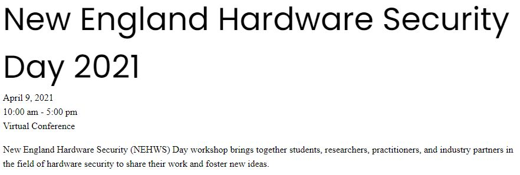

* [NEHWS 2023](#nehws-2023--northeastern-university-boston), 4/7/2023, Northeastern University, Boston
* [NEHWS 2022](#nehws-2022--university-of-massachusetts-amherst), 4/1/2022, University of Massachusetts, Amherst
* [NEHWS 2021](#nehws-2021--virtual), 4/9/2021, Virtual

### NEHWS 2023 @ Northeastern University, Boston ###

The third NEHWS was organized on 7 April, 2023 at the Northeastern University in Boston.

|    	 |                                                                                 |
| ---------------------- | -------------------------------------------------------------------------------------- |
| **9:00&nbsp;-&nbsp;9:15** | **Welcome Remarks:** [Gregory D. Abowd](https://coe.northeastern.edu/people/abowd-gregory/), Dean of Engineering, Northeastern University      |
|                           | Session Chair: Yunsi Fei |
| **9:15 - 9:30**      | **News from the NEHWS Community**                                                          |
|                      | Session Chair: Dan Holcomb |
| **9:30 - 10:30**    | **Invited Keynote:** <u>Kevin Fu</u>, *Wicked bizarre semiconductor physics of sensor security* |
|                     | Session Chair: Dan Holcomb |
| **10:30&nbsp;-&nbsp;10:45**  | Break                                                                                  |
| **10:45 - 12:00**  | **Submitted Talks Session I**                                                              |
|                    | Session Chair: Fatemeh Ganji |
| 			| **Long Talk:** [*Fuzzing for discovering bugs and side channels in processors*]({{ site.baseurl }}/images/fuzzing.pdf)|
| 			| <u>Chathura Rajapaksha</u>, Sadullah Canakci, Leila Delshadtehrani, Anoop Nataraja, Michael Bedford Taylor, Manuel Egele and Ajay Joshi (Boston University and University of Washington) |
| 			| **Short Talk:** [*Citadel: Side-Channel-Resistant Enclaves with Secure Shared Memory on a Speculative Out-of-Order Processor*]({{ site.baseurl }}/images/citadel.pdf) |
| 			| <u>Jules Drean</u>, Miguel Gomez-Garcia, Thomas Bourgeat and Srinivas Devadas (MIT) |
| 			| **Long Talk:** *A Model Extraction Attack on Deep Neural Networks Running on GPUs* |
| 			| Jonah O'Brien Weiss, Dong Hyub Kim, Tiago Alves and <u>Sandip Kundu</u>  (University of Massachusetts Amherst) |
| 			| **Short Talk:** *HammerDodger: A Lightweight Defense Framework against RowHammer Attack on DNNs* |
| 			| <u>Cheng Gongye</u>, Yukui Luo, Xiaolin Xu and Yunsi Fei (Northeastern University) |
| 			| **Long Talk:** [*Pensieve: Microarchitectural Modeling for Formal Security Evaluation*]({{ site.baseurl }}/images/pensieve.pdf) |
| 			| <u>Yuheng Yang</u>, Thomas Bourgeat, Stella Lau and Mengjia Yan (MIT) |
| 			| **Short Talk:** *Goblin: Time Is Money, Friend! Timing Side-channel Attack against Garbled Circuit Constructions* |
| 			| <u>Mohammad Hashemi</u>, Domenic Forte and Fatemeh Ganji (WPI) |
| **12:00 - 1:30**    | **Lunch and Poster Session** sponsored by [MITRE](https://www.mitre.org)                          |
| **1:30 - 2:30**     | **Panel Discussion:** Security of Hardware Systems in a Zero-trust Model                 |
|                     | Session Chair: Shahin Tajik |
|                     | Panelists:                                                                             |
|                     | - Lei Poo (Analog Devices)  |
|                     | - Dan Walters (MITRE)                                                       |
|                     | - Hamed Okhravi (MIT Lincoln Lab)                                           |
|                     | - Sandhya Koteshwara (IBM)                                                  |
|                     | - Sina Shahbazmohamadi (University of Connecticut)                         |
| **2:30 - 3:30**     | **Invited Keynote:** <u>Ran Canetti</u>, *From NAND to SCOTUS*   |
|                     | Session Chair: Fatemeh Ganji |
| **3:30 - 3:40**     | Break                                                                                  |
| **3:40 - 4:45**     | **Submitted Talks Session II**                                                         |
|                     | Session Chair: Dan Holcomb |
| 			| **Long Talk:** *Security vs Testability* |
| 			| <u>Deniz Karakoyunlu</u> (Analog Devices) |
| 			| **Short Talk:** *ImpedanceVerif: On-Chip Impedance Sensing for System-Level Tampering Detection* |
| 			| <u>Tahoura Mosavirik</u>, Patrick Schaumont and Shahin Tajik (WPI) |
| 			| **Long Talk:** [*The Next Frontier in Hardware Security: Quantum Computers*]({{ site.baseurl }}/images/presentation_szefer.pdf)  |
| 			| <u>Jakub Szefer</u> (Yale University) |
| 			| **Short Talk:** [*Hardware Security Analyses in Advanced Manufacturing Industry*]({{ site.baseurl }}/images/hardware.pdf) |
| 			| <u>Qiaoyan Yu</u> (University of New Hampshire) |
| 			| **Long Talk:** *EMShepherd: Detecting Adversarial Samples via Side-channel Leakage* |
| 			| <u>Ruyi Ding</u>, Cheng Gongye, Siyue Wang, A. Adam Ding and Yunsi Fei (Northeastern University) |
| **4:45 - 5:00**       | **Best Poster Award and Closing Remarks**                                                  |
|                       | Session Chair: Xiaolin Xu and Yunsi Fei |
| **5:00 - 6:00**       | **Networking reception** sponsored by [Draper](https://www.draper.com/)                    |

**Awards**

Congratulations to the winners of the Best Poster Awards! The awards were decided by popular vote of the audience. We thank [NewAE](https://www.newae.com/) and [Riscure](https://www.riscure.com) for donating the [hardware](https://rtfm.newae.com/Capture/ChipWhisperer-Husky/) and [book](https://nostarch.com/hardwarehacking) awards.

**First Place**
Yuheng Yang, Thomas Bourgeat, Stella Lau and Mengjia Yan, "Pensieve: A Modular Approach for Security Evaluation of Microarchitectural Designs"

**Second Place, tied**
Max Cohen Hoffing, "Voltage Sensor Development for PDN PUF"

**Second Place, tied**
Jonah O'Brien Weiss, Sandip Kundu, Dong Hyub Kim and Tiago Alves, "A Side-Channel Model Extraction Attack on Deep Neural Networks Running on GPUs"

**Second Place, tied**
Xiang Zhang, Aidon Ding and Yunsi Fei, "Software Power Side-channel Assisted Model Extraction of Deep Neural Networks"

**Third Place**
Andrew Adiletta, M. Caner Tol, Yarkin Doroz and Berk Sunar, "Memory Mayhem: Targeted Corruption of Registers and Stack Variables"

### NEHWS 2022 @ University of Massachusetts, Amherst ###

The second NEHWS was organized on 1 April, 2022 at the Unversity of Masschusetts in Amherst.

| Presentation Topic     |                                                                                        |
| ---------------------- | -------------------------------------------------------------------------------------- |
| **9:30 - 9:35**        | Welcome Remarks (Dan Holcomb)                                                          |
| **9:35 - 10:30**       | News from the NEHWS Community                                                          |
|                        | - Fatemeh Ganji (WPI)                                                                  |
|                        | - Dan Holcomb (Umass)                                                                  |
|                        | - Yunsi Fei (NEU)                                                                      |
|                        | - Jakub Szefer (Yale)                                                                  |
| **10:30 - 11:30**      | Invited Keynote: **Srinivas Devadas** (MIT)                                                |
| **11:30 - 1:00**       | Lunch and Poster Session                                                               |
| **1:00 - 3:00**        | Research Talks                                                                         |
|                        | - **Mengjia Yan** (MIT), "Security Analysis of Misunderstood  |
|                        |     Micro-architectural Side-Channel Attacks and Mitigations" |
|                        | - **Jens-Peter Kaps** (GMU), "Benchmarking FPGA Implementations |
|                        |     of Candidates in the NIST LWC Standardization Process" |
|                        | - **Colin O'Flynn** (NewAE), "Hands on with Non-Invasive |
|                        |      Hardware Security Tooling"       |
| **3:00 - 3:30**        | Break                                                                                 |
| **3:30 - 4:30**        | Panel Discussion: Driving Forces of Innovation in Security of |
|                        |  Microelectronics Supply Chain |
|                        | Moderator: Shahin Tajik (WPI)                                                         |
|                        | Panelists:                                                                            |
|                        | - **Peter Grossmann** (Instrinsix)                                                        |
|                        | - **Elke De Mulder** (Rambus)  |
|                        | - **Richard Newell** (Microchip Technology) |
|                        | - **John Oakley** (SRC) |
|                        | - **Ingrid Verbauwhede** (KUL) |
| **4:30 - 5:00**        | Networking and Closing |

**Posters**

- *A Cross-Platform Cache Timing Attack Framework via Deep Learning*, Ruyi Ding, Ziyue Zhang, Xiang Zhang, Gongye Cheng, Yunsi Fei and A. Adam Ding,

- *Bitsliced NTT-based Polynomial Multiplication: A Generic Software Countermeasure against Fault Attacks*, Richa Singh, Saad Islam, Berk Sunar and Patrick Schaumont

- *A Novel Differential-Bit Side-channel Power Attack on ECDH and Countermeasures*, Tianhong Xu, Cheng Gongye and Yunsi Fei

- *ScatterVerif: Verification of Electronic Boards Using Reflection Response of Power Distribution Network*, Tahoura Mosavirik, Fatemeh Ganji, Patrick Schaumont and Shahin Tajik

- *Garbled EDA: Privacy Preserving Electronic Design Automation*, Mohammad Hashemi, Steffi Roy, Fatemeh Ganji and Domenic Forte

- *Side-channel analysis of ASCON*, Dillibabu Shanmugam, Pantea Kiaei and Patrick Schaumont

- *Toward Realistic Backdoor Injection Attacks on DNNs using Rowhammer*, M. Caner Tol, Saad Islam, Berk Sunar and Ziming Zhang

- *Quantum Computer Antivirus*, Sanjay Deshpande, Chuanqi Xu, Theodoros Trochatos, Hanrui Wang, Ferhat Erata, Song Han, Yongshan Ding and Jakub Szefer

- *Leaky Frontends: Security Vulnerabilities in Processor Frontends*, Bowen Huang, Shuwen Deng and Jakub Szefer

- *Towards Automatic Detection of Power Side-Channel Vulnerabilities in Constant-Time Cryptography*, Ferhat Erata, Ruzica Piskac, Victor Mateu, Santos Merino del Pozo and Jakub Szefer

- *Improving the Performance and Security of Prior Work SSE-RV*, Zhiming Zhang and Yunsi Fei

- *Precise Fault Injection to Enable DFIA for Attacking AES in Remote FPGAs*, Xiang Li, Russell Tessier and Daniel Holcomb

- *Threat Modeling and Risk Analysis for Miniaturized Wireless Biomedical Devices*, Vladimir Vakhter, Betul Soysal, Patrick Schaumont and Ulkuhan Guler

- *Remote Power Side-Channel Attacks against Hardware Accelerators in FPGA*, Shayan Moini

- *Saidoyoki: Post-Silicon Side-Channel Evaluation*, Ramazan Kaan Eren, Pantea Kiaei, Zhenyuan Liu and Patrick Schaumont

- *DAGguise: Mitigating Memory Timing Side Channels*, Peter Deutsch, Yuheng Yang, Thomas Bourgeat, Jules Drean, Joel Emer and Mengjia Yan

- *Gate-Level Pre-Silicon Side-Channel Leakage Assessment*, Pantea Kiaei, Yuan Yao, Zhenyuan Liu and Patrick Schaumont

- *Security from CAD Tools Perspective for Using Dynamic Partial Reconfiguration in on-premise and off-premise FPGAs*, Sandeep Sunkavilli and Qiaoyan Yu

- *RansNet: An Anti-Ransomware Methodology based on Cache Monitoring and Deep Learning*, Xiang Zhang, Ziyue Zhang, Ruyi Ding, Cheng Gongye, Adam Ding and Yunsi Fei

- *Root-cause Analysis of Power-based Side-channel Leakage in Lightweight Cryptography Candidates*, Zhenyuan Liu and Patrick Schaumont

- *Security Risks and Challenges for Low-power Edge devices in Advanced Manufacturing*, Mohammad Monjur and Qiaoyan Yu

- *There’s Always a Bigger Fish: A Case Study of a Misunderstood Timing Side Channel*, Jack Cook, Jules Drean, Jonathan Behrens and Mengjia Yan

- *PCIe-Contention-Based Covert Channel in Cloud FPGAs*, Shanquan Tian, Ilias Giechaskiel and Jakub Szefer

- *Signature Correction Attack on Dilithium Signature Scheme*, Saad Islam, Koksal Mus, Richa Singh, Patrick Schaumont and Berk Sunar

### NEHWS 2021 @ Virtual ###

The first NEHWS was organized on 9 April, 2021 as a Virtual Conference

| Presentation Topic     |                                                                                        |
| ---------------------- | -------------------------------------------------------------------------------------- |
| **10:00 - 10:05**      | Welcome Remarks                                                                        |
| **10:05 - 11:00**      | Invited Keynote: **Wajdi Feghali** (Intel) |
| **11:00 - 11:30**      | Community Introduction                      |
|                        | - Worcester Polytechnic Institute |
|                        | - University of Massachusetts at Amherst |
|                        | - Northeastern University |
|                        | - Yale University |
| **11:30 - 12:30**      | Research Talks                                                                         |
|                        | - **Christof Paar** (Max Planc Institute of Security and Privacy)  |
|                        | - **Dominic Rizzo** (Google) |
|                        | - **Jean-Pierre Seifert** (Technical University of Berlin) |
| **12:30 - 1:00**       | Lunch Break                                                                                 |
| **1:00 - 2:00**        | Poster Session |
| **2:00 - 3:00**        | Panel Discussion: The Future of Hardware Security |
|                        | Panelists:                                                                            |
|                        | - **Todd Austin** (University of Michigan) |
|                        | - **Kevin Bush** (MIT Lincoln Lab) |
|                        | - **Joe Chapman** (MITRE) |
|                        | - **Dave King** (General Dynamics Mission Systems) |
|                        | - **Lei Poo** (Analog Devices) |
| **3:00 - 4:00**        | Networking and Closing |
