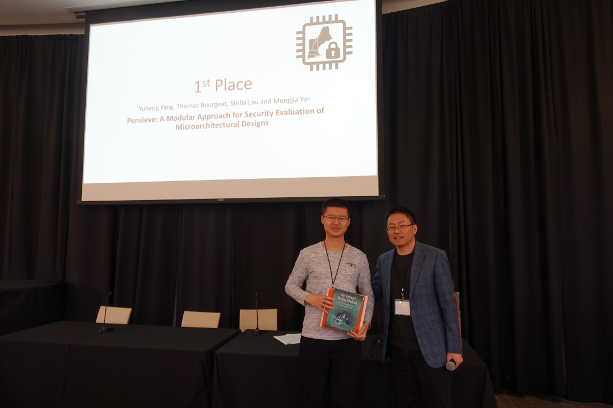
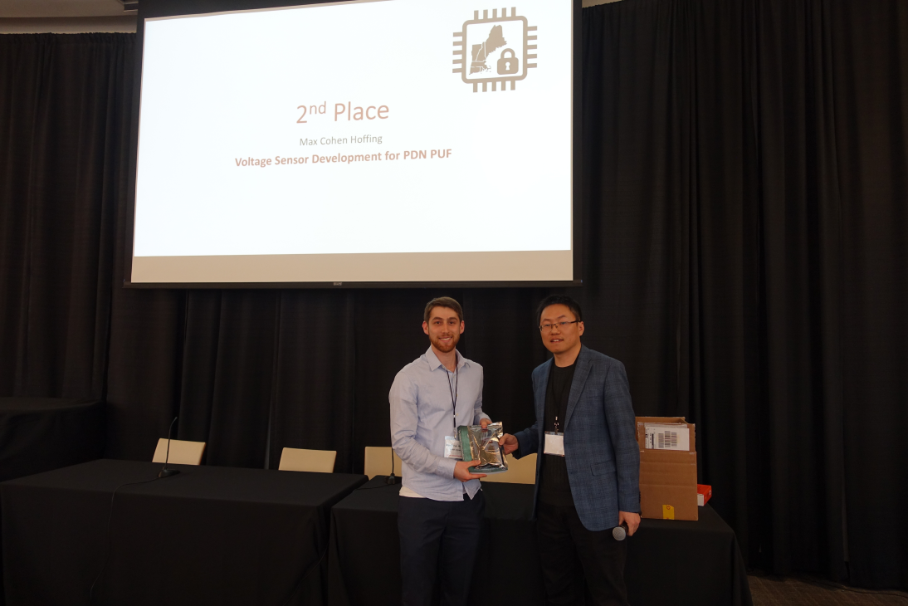
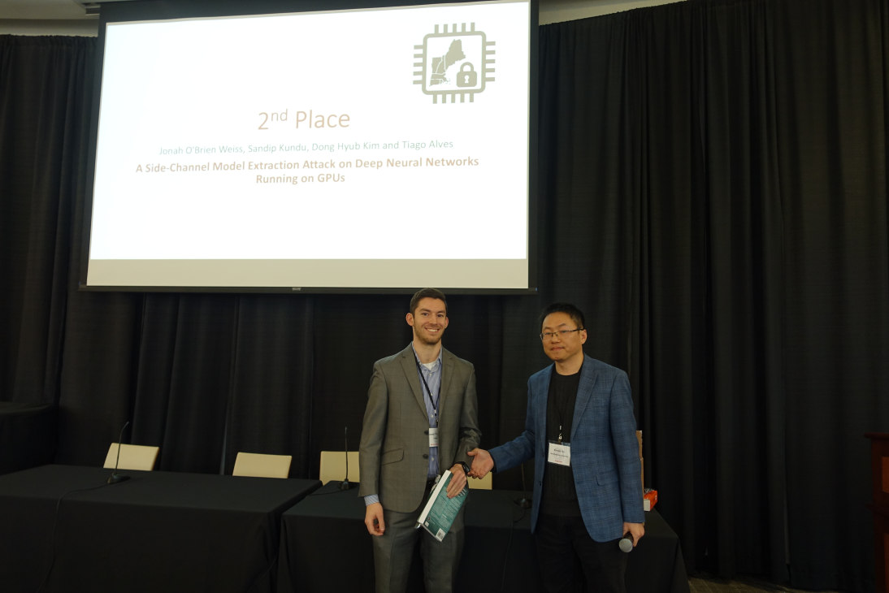
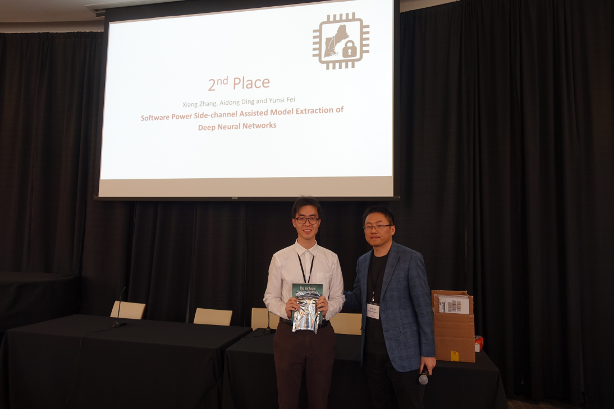
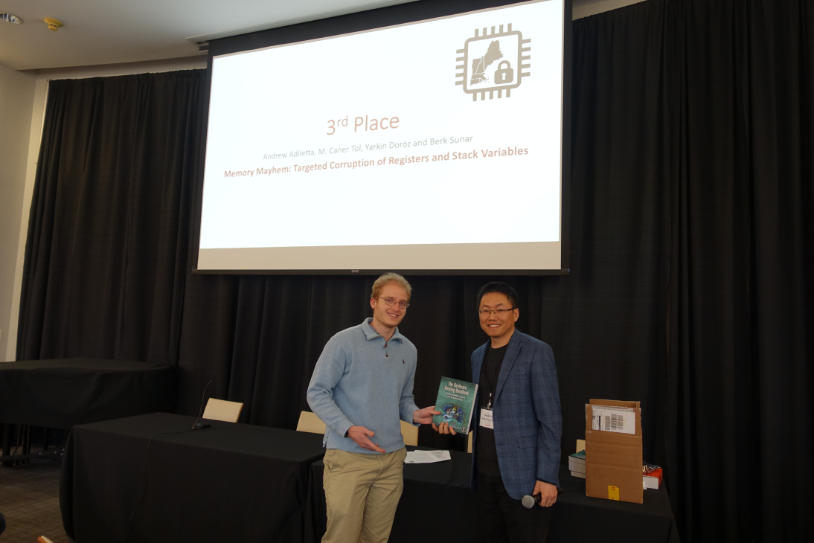

### **Awards** ###

Congratulations to the winners of the Best Poster Awards!

**First Place**
Yuheng Yang, Thomas Bourgeat, Stella Lau and Mengjia Yan, "Pensieve: A Modular Approach for Security Evaluation of Microarchitectural Designs"

**Second Place, tied**
Max Cohen Hoffing, "Voltage Sensor Development for PDN PUF"

**Second Place, tied**
Max Cohen Hoffing, "Voltage Sensor Development for PDN PUF"

**Second Place, tied**
Jonah O'Brien Weiss, Sandip Kundu, Dong Hyub Kim and Tiago Alves, "A Side-Channel Model Extraction Attack on Deep Neural Networks Running on GPUs"

**Second Place, tied**
Xiang Zhang, Aidon Ding and Yunsi Fei, "Software Power Side-channel Assisted Model Extraction of Deep Neural Networks"

**Three Place**
Andrew Adiletta, M. Caner Tol, Yarkin Doroz and Berk Sunar, "Memory Mayhem: Targeted Corruption of Registers and Stack Variables"

{: style="width: 20%; float: center; margin: 5px"}
{: style="width: 20%; float: center; margin: 5px"}
{: style="width: 20%; float: center; margin: 5px"}
{: style="width: 20%; float: center; margin: 5px"}
{: style="width: 20%; float: center; margin: 5px"}
