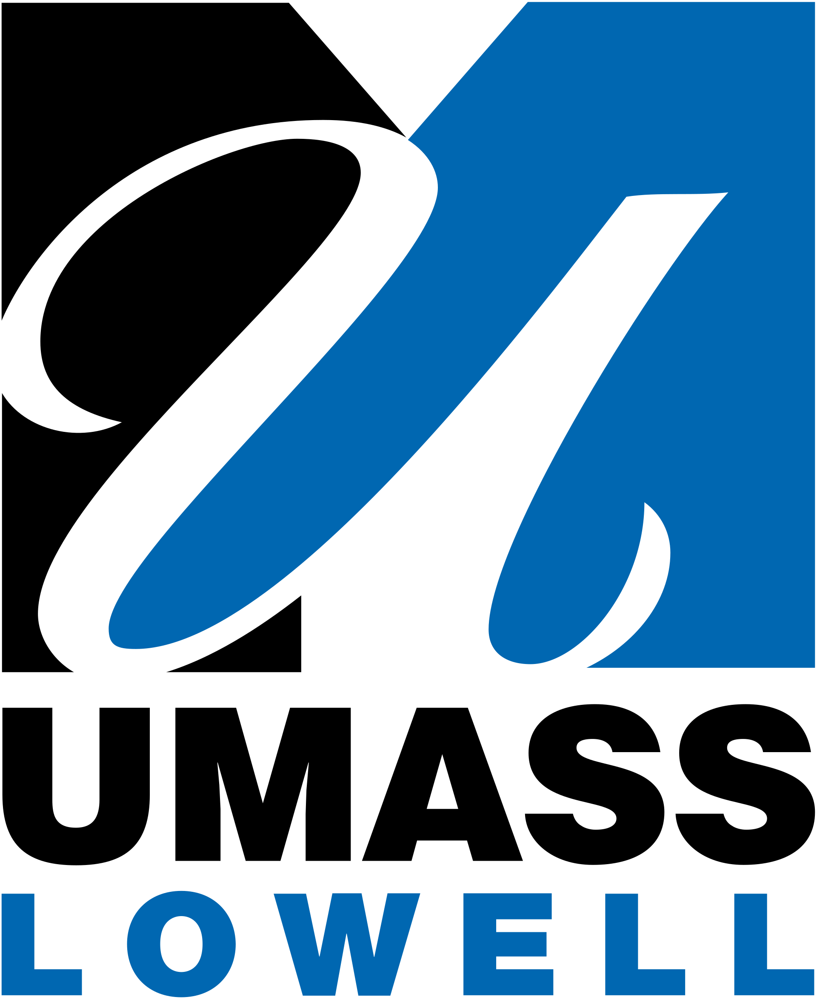

{: style="width: 150px; display: block; margin: auto;"}

<strong>Date: April 24, 2026</strong>

<strong>
<a href="/venue/" target="_blank" rel="noopener">Venue:</a>  <a href="https://www.tufts.edu" target="_blank" rel="noopener">Tufts University, Medford, MA</a> 

New England Hardware Security (NEHWS) Day brings together
many students, researchers, practitioners, and industry partners in the
field of hardware security to share their work and foster new ideas.

<!-- **Registration is now closed as we have reached full capacity. If you have any concerns, please contact [contact@nehws.org](mailto:contact@nehws.org).** -->
<!-- **Registration details forthcoming. For questions, please contact [contact@nehws.org](mailto:contact@nehws.org).** -->
**[Register here.](https://nehws.org/registration) For questions, please contact [contact@nehws.org](mailto:contact@nehws.org).**

Join us for an enlightening journey into the world of hardware security, featuring industry-leading speakers, and unparalleled networking opportunities. Whether you're a seasoned professional, a curious student, or somewhere in between, NEHWS is the key event to explore the latest in hardware security technologies, trends, and research.

<!-- <a href="images/Program_All.pdf" style="font-size: 20px;">**Now Available: NEHWS 2025 Proceedings**</a> -->

**Reception**

Join us at the closing reception of NEHWS'26 for drinks, light foods, and short project updates from [**OPTIMIST**](https://optimist-ose.org/) and [**WHAAAM**](https://sites.google.com/view/whaaam). These two community-driven efforts are highly relevant to NEHWS: 
[OPTIMIST](https://optimist-ose.org/) focuses on open tools, interfaces, and metrics for implementation security testing, with emphasis on interoperability, trace formats, common APIs, AI for implementation security testing, and post-quantum cryptography. [WHAAAM](https://sites.google.com/view/whaaam) complements this by advancing artifact-driven, reproducible work on hardware attack artifacts, analysis, and metrics, with a strong focus on practical attacker capabilities, countermeasures, and real-world relevance. 
Together, they reflect NEHWS’s mission of bringing the hardware security community together to share ideas, artifacts, and new directions.  

**Call for Contributions**

<!-- Details will be announced soon. -->
<!-- Please consider submitting your work for presentation at NEHWS 2026. -->
<!-- We are looking for announcements, research talks, and posters.  -->

<!-- * [Call for Contributions](../images/nehws26_cfp.pdf) -->

<!-- The submission deadline is TBD. -->

The submission period has closed. You can view the [program here](https://nehws.org/program/).

* [Download the Call for Contributions.](../images/nehws26_cfp_extended_new.pdf) 
<!-- * Submit your contribution at the <a href="https://easychair.org/conferences/?conf=nehws2026" target="_blank">NEHWS26 submission site</a>. -->
<!-- * ~~**Deadline for submission is February 10, 2026.**~~ **Final extended submission deadline is February 17, 2026.** -->

**Call for Sponsors**

Sponsors of NEHWS will gain visibility for their companies and
associate themselves with an active regional community that
contributes to training the next-generation workforce in hardware
security.

* Questions? Contact the NEHWS organizers at [contact@nehws.org](mailto:contact@nehws.org)

[//]: <> * [Download the flyer](images/nehws24-call-for-sponsors.pdf)

**NEHWS is driven by the hardware security research community at these universities**

<figure class="fourth">
  
  
  
  
  
  

  
  
  
  
  
</figure>

 

