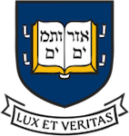

### **Organization** ###

**NEHWS is driven by the hardware security research community at these universities**

<figure class="fourth">
  
  
  
  
  
  
</figure>

**NEHWS 24 Organizers**

| General Chair                 |  Daniel Holcomb | 
| PC Chair                       |  Fatemeh (Saba) Ganji | 
| PC Co-Chair                  |   Xiaolin Xu | 
| Industry Co-Chairs          |    Yunsi Fei and Patrick Schaumont | 
| Local Co-Chairs                |  Berk Sunar and Shahin Tajik | 
| Outreach Co-Chairs    |  Shahin Tajik and Mengjia Yan | 
| Panel Co-Chairs               |  Mengjia Yan and Shahin Tajik | 
| Poster Co-Chairs             |  Koksal Mus and Qiaoyan Yu | 
| Publicity Co-Chairs    |  Yarkin Doroz and Jakub Szefer | 
| Web Chair                     |  Kemal Derya | 

 

**NEHWS 24 Program Committee**

**TBD**