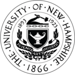

### **Organization** ###

**NEHWS is driven by the hardware security research community at these universities**

<figure class="fourth">
  
    
    
  
  
   
  
  
  
  
  
</figure>

**NEHWS 26 Organizers**

<!-- | General Chair                       | Shahin Tajik  |
| Local Chair                         | Yingjie Lao |
| PC Chair                            |   | 
| PC Co-Chair                         |    | 
| Industry Co-Chairs                  |     | 
| Outreach Co-Chair                   |  | 
| Panel Chair                         |  | 
| Poster Co-Chair                     |  | 
| Publicity Co-Chairs  &nbsp; &nbsp;  |  | 
| Web Co-Chairs                           | Sanjay Deshpande and  Sinuo Fan|  -->

|General Chair     | Shahin Tajik                     |
|Local Chairs      | Yingjie Lao and Marco Donato     |
|Program Chair     | Dean Sullivan                    |
|Co-program Chair  | Prabuddha Chakraborty            |
|Panel chair       | Berk Sunar and Patrick Schaumont |
|Industry Chair    | Shahin Tajik                     |
|Poster Chair      | Seetal Potluri                   |
|Publication Chair | Fatemeh (Saba) Ganji             |
|Publicity Chair   | Kanad Basu                       |
|Web Chair         | Sanjay Deshpande                 |

 

**NEHWS 26 Program Committee**

|Debdeep Mukhopadhyay   |
|Berk Sunar             | 
|Patrick Schaumont      |
|Daniel Holcomb         |
|Orlando Arias          |
|Xiaolong Guo           | 
|Maitreyi Ashok         |
|Minrui Yan             |
|Ayesha Siddique        |
|Haoqi Shan             |
|Yukui Luo              |
|Ramya Jayaram Masti    |
|Sandeep Sunkavilli     |
|Sandhya Koteshwara     |
|Ruyi Ding              |
|Xiaonglong Feng        |
|Honggang Yu            |

 