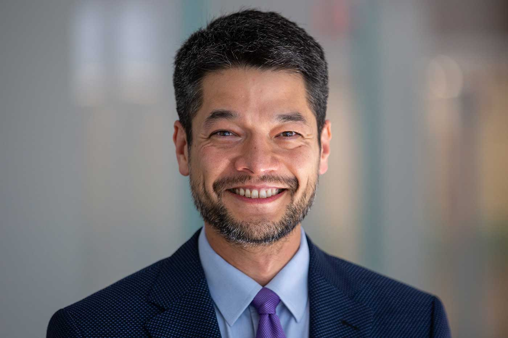
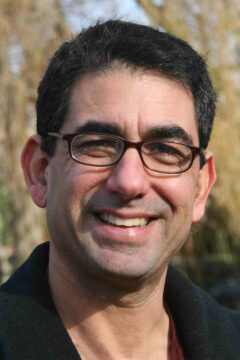

**Kevin Fu**

{: style="width: 60%; float: center; margin: 5px"}

Talk title: Wicked Bizarre Semiconductor Physics of Sensor Security

Bio:

Kevin Fu is Professor of Electrical and Computer Engineering in the College of Engineering and the Khoury College of Computer Sciences at Northeastern University, where he directs the Archimedes Center for Health Care and Medical Device Cybersecurity. Fu previously served as the nation's inaugural Acting Director of Medical Device Cybersecurity at U.S. FDA’s Center for Devices and Radiological Health (CDRH) and Program Director for Cybersecurity at the Digital Health Center of Excellence (DHCoE). His research vision is a world where science-based security is built-in by design to all embedded systems: medical devices, healthcare delivery, autonomous transportation, manufacturing, and the Internet of Things. His research lab focuses on analog cybersecurity—how to model and defend against threats to the physics of computation and sensing. Fu is most known for his security research on cryptographic and low-power inventions to defend against vulnerabilities in an implantable cardiac defibrillator. His research led to a decade of revolutionary improvements at medical device manufacturers, global regulators, and international healthcare safety standards bodies. Security solutions resulting from this research foresaw the risks of malicious software affecting hospitals a decade before ransomware began to disrupt clinical workflow worldwide. 

Fu has been recognized as an ACM Fellow, IEEE Fellow, Sloan Research Fellow, and MIT Technology Review TR35 Innovator of the Year. He is a recipient of a Feb100 Award and NSF CAREER Award. He received best paper awards from USENIX Security, IEEE Security & Privacy, and ACM SIGCOMM. His research on pacemaker security received an IEEE Security & Privacy Test of Time Award. He co-founded healthcare cybersecurity startup Virta Labs. Fu has testified in the House and Senate and was commissioned by the National Academy of Medicine for a report on trustworthy medical device software. He serves as a member of the Association for the Advancement of Medical Instrumentation (AAMI) Biomedical Instrumentation & Technology Editorial Board, the ACM Committee on Computers and Public Policy, and the USENIX Security Steering Committee. He chairs the USENIX Security Test of Time Awards Selection Committee. He chaired the USENIX Security PC and served as the inaugural co-chair of the AAMI cybersecurity working group to create the first FDA-recognized consensus standards to improve the security of medical device manufacturing. He founded the Archimedes Center for Healthcare and Device Security, and co-founded the N95decon.org team for emergency reuse decontamination of N95 masks during pandemic shortages. Fu served as a member of the U.S. NIST Information Security and Privacy Advisory Board and federal science advisory groups. Fu received his BS, MEng, and PhD from MIT. He earned a certificate of artisanal bread making from the French Culinary Institute, builds wood-fired brick ovens, and enjoys woodworking.

**Ran Canetti**

{: style="width: 40%; float: center; margin: 5px"}

Talk title: TBD

Bio:

Ran Canetti is a professor of Computer Science at Boston University and the director of the center for Reliable Information System and Cyber Security. He is also a Fellow of the International Association for Cryptologic Research and an associate editor of the Journal of Cryptology and Information and Computation. Canetti graduated from the Weizmann Institute of Science, was a researcher at IBM Watson Research Center, a research scientist at MIT and a professor at Tel Aviv University. Canetti’s research interests span multiple aspects of cryptography and information security, with emphasis on the design, analysis and use of cryptographic protocols.

 
 

