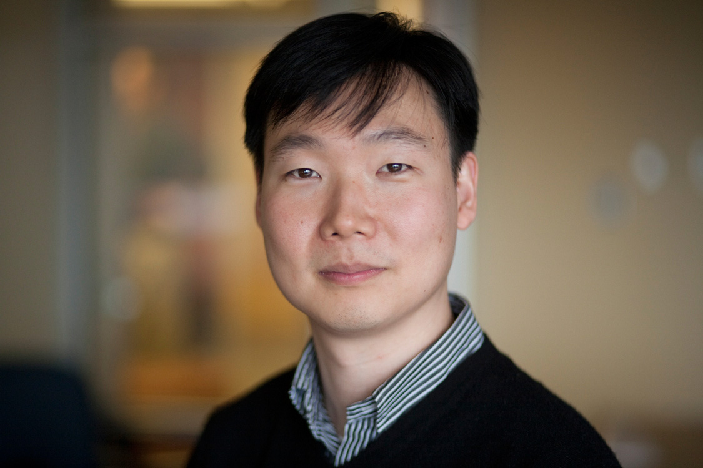

### **Speakers** ###

### **Edward Suh** ###
**NVIDIA**

[//]: <> **Talk title: Don’t Trust, and Verify**

[//]: <> **Abstract:** In this talk I will address two distinct vectors at the frontier of hardware security:
[//]: <> 1. Given the challenges in defending against unknown attacks, an important vector in
[//]: <> hardware security is obfuscation-based defenses, where randomization and encryption
[//]: <> are used to increase the design entropy that an attacker needs to overcome for direct
[//]: <> access to secrets, or indirect access through first accessing critical system information
[//]: <> assets needed to mount a successful attack.
[//]: <> 2. Hardware defenses, through obfuscation or microarchitecture structures, are subject to
[//]: <> implementation bugs just as the rest of the design, and thus need to be verified/validated
[//]: <> prior to deployment. Given the higher costs of security design bug escapes, formally
[//]: <> verifying these defenses is gaining increasing importance.

[//]: <> I will discuss specific projects along both these vectors driven by practical concerns of low
[//]: <> design overhead and scalability of formal verification techniques.
[//]: <> This is joint work with the groups of Todd Austin (Michigan), Lauren Biernacki (Lafayette
[//]: <> College), Thomas Bourgeat (EPFL) and Mengjia Yan (MIT).

{: style="width: 300px; float: left;
margin: 5px"} **Bio:** G. Edward Suh is a Senior Director of Research, and leads a group in security 
and privacy research. He is also an Adjunct Professor in the School of Electrical and Computer 
Engineering at Cornell University, where he served on the faculty from 2007 to 2023. Before joining 
NVIDIA, he was a Research Scientist in the Fundamental AI Research (FAIR) team at Meta. He earned 
a B.S. in Electrical Engineering from Seoul National University and an M.S. and a Ph.D. in Electrical 
Engineering and Computer Science from the Massachusetts Institute of Technology (MIT). His research 
interests include computer systems in general with particular focus on computer architecture and 
security. His recent research focuses on building secure computing systems for secure and private 
AI, and using AI to improve the security of computer systems. His past research received multiple 
test-of-time awards and is widely recognized for the impact at the intersection of hardware and security. 
For example, his work on Physical Unclonable Function (PUF) is now used in commercial products such as 
Xilinx FPGAs for storing secret keys. His work on the AEGIS secure processor received a test-of-time 
award for its contribution for trusted execution environments deployed across the industry today. He is a 
Fellow of IEEE.

 
 
 