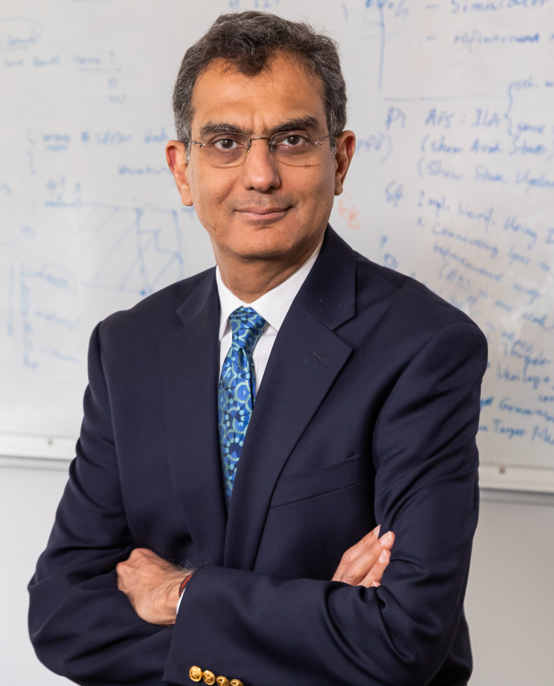

### **Sharad Malik** ###
**Princeton University**

**Talk title: Don’t Trust, and Verify**

**Abstract:** In this talk I will address two distinct vectors at the frontier of hardware security:
1. Given the challenges in defending against unknown attacks, an important vector in
hardware security is obfuscation-based defenses, where randomization and encryption
are used to increase the design entropy that an attacker needs to overcome for direct
access to secrets, or indirect access through first accessing critical system information
assets needed to mount a successful attack.
2. Hardware defenses, through obfuscation or microarchitecture structures, are subject to
implementation bugs just as the rest of the design, and thus need to be verified/validated
prior to deployment. Given the higher costs of security design bug escapes, formally
verifying these defenses is gaining increasing importance.

I will discuss specific projects along both these vectors driven by practical concerns of low
design overhead and scalability of formal verification techniques.
This is joint work with the groups of Todd Austin (Michigan), Lauren Biernacki (Lafayette
College), Thomas Bourgeat (EPFL) and Mengjia Yan (MIT).

{: style="width: 300px; float: left;
margin: 5px"} **Bio:** Sharad Malik is the George Van Ness Lothrop Professor of Engineering at Princeton University.
He has served as the Director of the multi-university MARCO Gigascale Systems Research
Center (GSRC, 2009-2012), and as the Associate Director of the Center for Future
Architectures Research (C-FAR, 2013-2016). His current research focuses on design
methodology for formal functional and security verification of hardware/hardware-software
systems. His research in functional timing analysis and propositional satisfiability has been
widely used in industrial electronic design automation tools. He has received the IEEE/ACM
Design Automation Conference (DAC) Award for the most cited paper in the 50-year history of
the conference (2013), the Computer-Aided Verification (CAV) Award for fundamental
contributions to the development of high-performance Boolean satisfiability solvers (2009), the
IEEE CEDA A. Richard Newton Technical Impact Award in Electronic Design Automation
(2017), the Princeton University President’s Award for Distinguished Teaching (2009), as well
as several other research and teaching awards. He has also received the UC Berkeley
Electrical Engineering and Computer Science Distinguished Alumni Award (2019) and the IIT
Delhi Distinguished Alumni Award (2009). He is a fellow of the IEEE and ACM.

 
 
 

### **Andreas Olofsson** ###
**Zero ASIC**

**Talk title: Composable chiplets and implications for disaggregated design**

**Abstract:** The compounding effect of monolithic miniaturization on electronics has been nothing short of miraculous. In the 1960s, $1 would get you a single slow and bulky transistor. In 2020, that same dollar adjusted for inflation buys you a System-On-Chip (SoC) with over  100 million incredibly fast nanoscale transistors. Now that physical device scaling is approaching hard atomic limits, the question is: Where will the next million fold computing efficiency improvement come from? Highly specialized heterogeneous application specific integrated circuits (ASICs) can offer 1000x improvement in Size, Weight, Power, and Cost (SWAP-C) compared to general-purpose processors. Unfortunately, circuit specialization is poorly aligned with the modern Moore’s Law silicon machine that prioritizes unit cost over engineering costs at all stages of development and manufacturing. In particular, two major economic roadblocks stand in the way of domain specific hyper specialized circuits: 
1. The design of leading edge monolithic chips costs $100M - $1,000M and takes years to complete, 
2. Monolithic integration of new devices and materials to advanced CMOS processes costs more than $1B and generally increases per unit production costs.

Chiplets offer a compelling solution to both of these roadblocks. In this talk I will give an overview of the chiplet design landscape and present recent efforts by Zero ASIC to create a system of composable 2D and 3D chiplets supported by a full stack of open interface standards.

{: style="width: 300px; float: left;
margin: 5px"} **Bio:** Andreas Olofsson is the founder and CEO of Zero ASIC, a chiplet semiconductor startup reducing the barrier to ASICs. From 2017 - 2020, Mr. Olofsson was a program manager at DARPA, where he managed 8 different US research programs in heterogeneous integration, EDA, design & verification, high performance computing, machine learning, and analog computing. From 2008-2017, Mr. Olofsson founded and managed Adapteva, an ultra lean fabless semiconductor startup that led the industry in processing energy efficiency. Prior to Adapteva he worked at Analog Devices for 10 years as a design manager and architect for advanced DSPs and mixed signal devices, developing products that shipped in over 100 million systems. Mr. Olofsson received his Bachelor of Science in Physics and Electrical Engineering and Master of Science in Electrical Engineering from the University of Pennsylvania. He is a senior member of IEEE and holds nine U.S. patents.