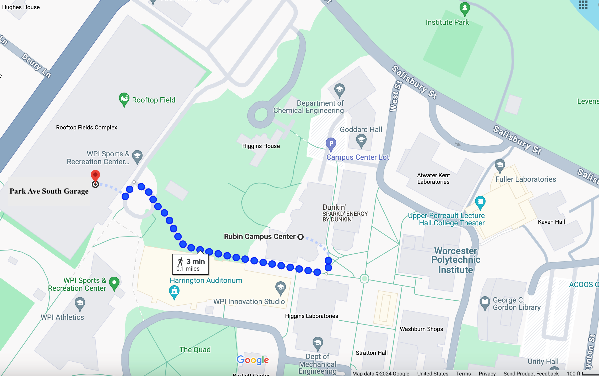

### **Venue & Travel** ###

**NEHWS 24 will take place at Worcester Polytechnic Institute in Worcester, MA.**

{: style="width: 60%; float: center; margin: 5px"}

### **Directions to Worcester Polytechnic Institute** ###

### **Park Avenue South Garage & Rubin Campus Center, 3rd Level** ###

Set your vehicle navigation system to 151 Salisbury Street, Worcester, MA. Or, follow these simple directions:

**From the East, South, and West**

Take Mass Turnpike (I-90) West to **Exit 10A** (RT 146). Follow signs to RT 146 North/Worcester. At the end of RT 146, enter **I-290 East** and take **Exit 17, RT 9** (Ware/Framingham). Turn left at top of ramp onto RT 9/Belmont Street. Stay in the right lane, and before the second traffic light, merge right onto Lincoln Street. Merge immediately into the left lane. At the first traffic light, curve left onto Salisbury Street. Proceed through three traffic lights and past several side streets, the art museum on the left, and a park on the right. The Higgins Parking lot is on the left, just before the Park Avenue intersection.  Proceed past the lot to the Parking Garage.

**From the North**

Take I-495 south to I-290 west into Worcester. Take Exit 18 (Lincoln Sq., Rte. 9), turn right at end of ramp, stay in right lane, merge right at fork before traffic light. This is Salisbury Street. Proceed through three traffic lights and past several side streets. Pass the art museum on the left, a park on the right, The Higgins Parking lot is on the left, just before the Park Avenue intersection.  Proceed past the lot to the Parking Garage.

**Walk from the parking garage to the Rubin Campus Center**

When exiting the garage proceed to the left.  At the first stop sign take a right, follow the path to a flight of stairs.  At the top of the stairs you will see Higgins House to your right.  Walk past the House and go under the overpass and up another flight of stairs. Walk through the parking lot.  To your right is a ramp between 2 buildings.  Follow this to the top, the Rubin Campus Center will be directly to your right.  Take the stairs to the 3rd level or walk past the information desk and follow the signs to the elevator.  Go up one flight.  Take a right out of the elevator go through a set of glass doors.  You will see the check in table setup outside of Odeum A.

{: style="width: 80%; float: center; margin: 5px"}