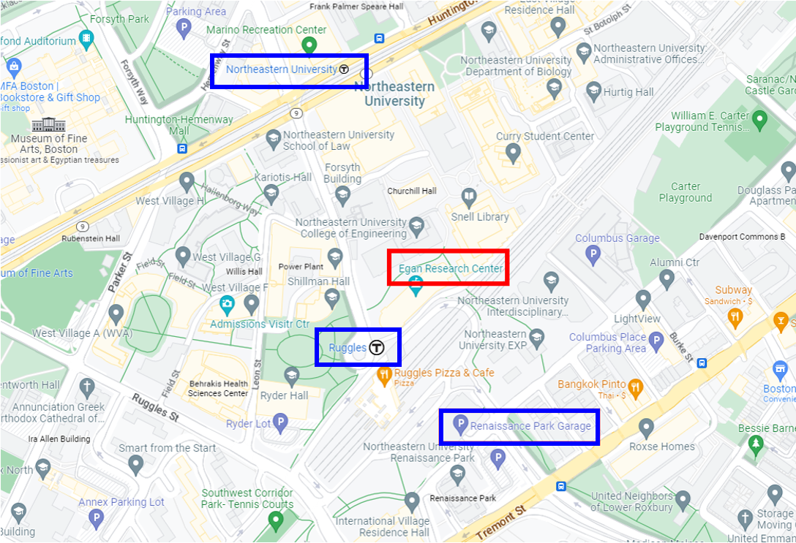

### **Venue** ###

**NEHWS 23 will take place at Northeastern University in the Raytheon amphitheater (Egan Research Center 240) in Boston, MA.**

* Venue Address: 360 Huntington Avenue, Boston, MA 02115
* [Directions to Northeastern University](https://campusmap.northeastern.edu/directions.html)
* Driving? Please park in the [Renaissance Garage](https://www.masparc.com/renaissance-park-garage/). Parking is $42/day, or [$35.20](https://go.lazparking.com/hello/#buynow?l=81997&start=Fri,%20Apr%2007,%202023%208:00%20AM&end=Fri,%20Apr%2007,%202023%207:00%20PM&t=r&wt=tmd&isocode=EN&wk=0ccd5b63ef08421380b32e86bf5e7efd) for a prepaid ticket.
* Public Transportation? [MBTA Green Line, E train, Northeastern stop](https://www.mbta.com/schedules/Green). 
* Public Transportation? [MBTA Orange Line, Ruggles stop](https://www.mbta.com/schedules/Orange). [$4.80](https://www.mbta.com/trip-planner?_utf8=%E2%9C%93&plan%5Bfrom%5D=Logan+Airport+Terminal+C%2C+East+Boston%2C+MA+02128%2C+United+States&plan%5Bfrom_latitude%5D=42.359740000000045&plan%5Bfrom_longitude%5D=-71.02723999999995&plan%5Bto%5D=Ruggles&plan%5Bto_latitude%5D=42.336377&plan%5Bto_longitude%5D=-71.088961#plan_result_focus) roundtrip from Logan Airport]
* Public Transportation? [Commuter Rail, Ruggles stop](https://www.mbta.com/schedules/commuter-rail). [$24.50](https://www.mbta.com/fares/commuter-rail-fares/zones) roundtrip from Worcester.

{: style="width: 80%; float: center; margin: 5px"}
