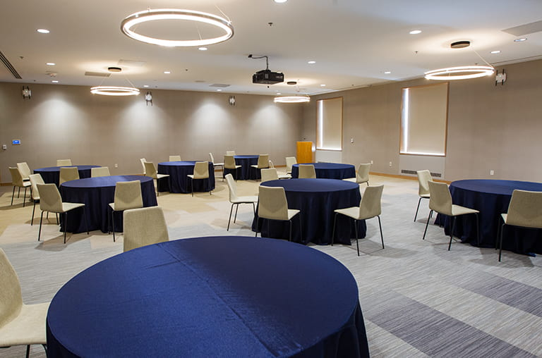
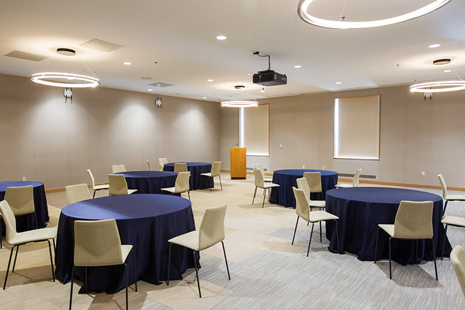
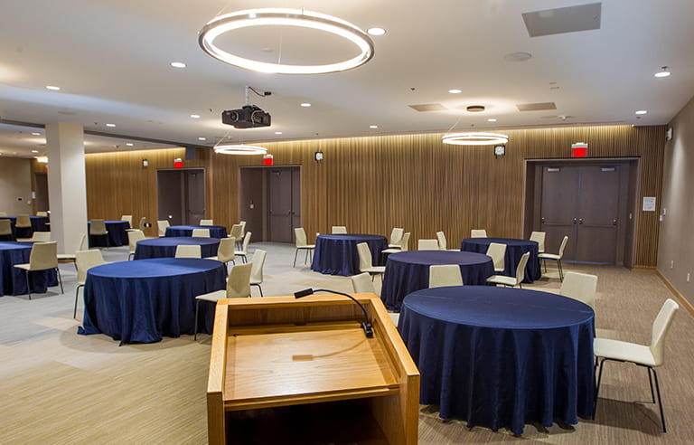

### **Venue & Travel** ###

**NEHWS 2026 will take place at Tufts University in Medford, MA.**

{: style="width: 80%; display: block; margin: auto;"}

### **Venue** ###

#### **Breed Memorial Hall** ####

51 Winthrop St, Medford, MA 02155

<!-- Leaflet CSS -->
<link rel="stylesheet" href="https://unpkg.com/leaflet@1.9.4/dist/leaflet.css"
     integrity="sha256-p4NxAoJBhIIN+hmNHrzRCf9tD/miZyoHS5obTRR9BMY="
     crossorigin=""/>

<!-- Leaflet Routing Machine CSS -->
<link rel="stylesheet" href="https://unpkg.com/leaflet-routing-machine@3.2.12/dist/leaflet-routing-machine.css" />

<!-- Leaflet JavaScript -->

<!-- Leaflet Routing Machine JavaScript -->

**💡 Tip:** Click markers for details, hover to preview information. Three walking routes shown: Blue (from parking), Purple (from T station), Orange (scenic route via landmarks).

### **Accommodation** ###

**Tufts Booking Site:** [https://campustravel.com/university/tufts-university/](https://campustravel.com/university/tufts-university/) (typically 5-15% cheaper)

* **[Homewood Suites Boston Cambridge](https://www.hilton.com/en/hotels/bosarhw-homewood-suites-boston-cambridge-arlington-ma/)**
  * [1 Massachusetts Ave, Arlington, MA 02474](https://maps.app.goo.gl/bDaEZi9Ee91ZwWqAA)
  * 1.1 miles from venue

* **[Hyatt Place Boston Medford](https://www.hyatt.com/hyatt-place/en-US/boszm-hyatt-place-boston-medford?src=corp_lclb_google_seo_boszm)**
  * [116 Riverside Ave, Medford, MA 02155](https://maps.app.goo.gl/Lq5hYecLgrfakj6d6)
  * 1.2 miles from venue

* **[Cambria Hotel](https://www.choicehotels.com/massachusetts/somerville/cambria-hotels/ma257?mc=llgoxxpx)**
  * [515 Somerville Ave, Somerville, MA 02143](https://maps.app.goo.gl/ra835cPiWURR8HWU6)
  * 2.4 miles from venue

* **[Fairfield By Marriott Boston Medford](https://www.marriott.com/en-us/hotels/bosfo-fairfield-boston-medford/overview/?scid=f2ae0541-1279-4f24-b197-a979c79310b0)**
  * [85 Station Landing, Boston, MA 02155](https://maps.app.goo.gl/Je85G7hcn1KVLr6B6)
  * 3.0 miles from venue

* **[Kimpton Marlowe Hotel](https://www.hotelmarlowe.com/?&cm_mmc=WEB-_-KI-_-AMER-_-EN-_-EV-_-Google%20Business%20Profile-_-DD-_-marlowe)** *(On T route)*
  * [25 Edwin Land Boulevard, Cambridge, MA 02141](https://maps.app.goo.gl/yyBPLtHiXY53KQm88)
  * 3.57 miles from venue

### **Parking** ###

* **[Dowling Hall Garage](https://maps.app.goo.gl/7wxvvjuXN8VgfxQb6)**
  * 419 Boston Ave, Medford, MA 02155
  * Adjacent to campus
  * Phone: (617) 627-3692

<!-- ### **Floor Plan** ###

The workshop will take place on **6th floor, Dining Room 3 & 4**.

{: style="width: 75%; display: block; margin: auto;"}

### **Dining Room 3 & 4** ###

{: style="width: 33%;"}  {: style="width: 33%;"}  {: style="width: 33%;"} -->
