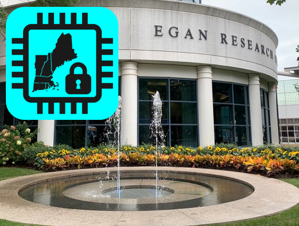

### **Venue** ###

**NEHWS 23 will take place at Northeastern University in the Egan Research Center in Boston, MA**

* Venue Address: 360 Huntington Avenue, Boston, MA 02115
* (Directions to Northeastern University)[https://campusmap.northeastern.edu/directions.html]
* Driving? Please park in the (Renaissance Garage)[https://www.masparc.com/renaissance-park-garage/]
* Public Transportation? Northeastern is accessible by subway via the Green Line of the MBTA. From downtown Boston, take an "E" train outbound to the Northeastern stop, the first stop above ground. The campus can also be reached from downtown via the Orange Line by taking any train going outbound to Forest Hills and getting off at Ruggles Station. Commuter rail lines connect with the Orange Line at Ruggles Station, Back Bay Station, and North Station.

{: style="width: 60%; float: center; margin: 5px"}

{: style="width: 60%; float: center; margin: 5px"}
